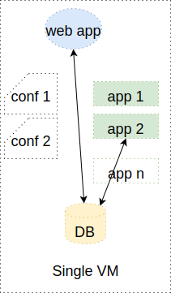

## Untitled

### Developing Applications
* Applications can consist of many components <!-- .element: class="fragment" data-fragment-index="0" -->   <!-- .element: class="img-right" style="width:30%;" -->
   * Web server (nginx, apache)
   * Database (sql, nosql)
   * Message Queue 
   * Your application
* <!-- .element: class="fragment" data-fragment-index="1" -->Typically spread across cluster of machines 

### Development vs Production

* Ideal scenario development environment identical to production <!-- .element: class="fragment" data-fragment-index="0" -->
* In practice this is often difficult to achieve  <!-- .element: class="fragment" data-fragment-index="1" -->
   * Limited CPU of dev machines <!-- .element: class="fragment" data-fragment-index="2" -->
   * Compromise is to develop everything in single VM <!-- .element: class="fragment" data-fragment-index="3" -->

<!-- .element: style="width:60%;float:left;"  -->

 <!-- .element: class="fragment" data-fragment-index="3" style="width:20%;float:left;" -->

### Pitfalls of Single VM Development
* Single VM development creates blindspot <!-- .element: class="fragment" data-fragment-index="0" -->
* Developers can make false assumptions about <!-- .element: class="fragment" data-fragment-index="1" -->
   * Which config files on which machines <!-- .element: class="fragment" data-fragment-index="2" -->
   * Dependency libraries present on machines <!-- .element: class="fragment" data-fragment-index="3" -->
* Difficult to scale individual services <!-- .element: class="fragment" data-fragment-index="4" -->
* Can lead to unpredictable behaviour when deployed to production <!-- .element: class="fragment" data-fragment-index="5" -->

### Containerise All The Things
* Each component is self-contained
   * dependencies
   * configuration
* Components can be independently
   * Started/Stopped
   * Updated
   * Scaled
* Brings us closer to production environment

### What's the Catch?
>Your Docker thingy still isn't <!-- .element: class="fragment" data-fragment-index="0" -->_exactly_ like production!

> Afterall our application(s) are deployed to machines and not as Docker
> <!-- .element: class="fragment" data-fragment-index="1" -->
> container thingies

### Designing Containerised Applications
* Containerised application should be <!-- .element: class="fragment" data-fragment-index="0" -->_smallest executable unit_
  * Single executable runner only <!-- .element: class="fragment" data-fragment-index="1" -->
  * No forked processes <!-- .element: class="fragment" data-fragment-index="2" -->
* No stored <!-- .element: class="fragment" data-fragment-index="3" -->_state_
  * Do not store entire DB in a container <!-- .element: class="fragment" data-fragment-index="4" -->
  * Do not rely on files or other persistant artefacts <!-- .element: class="fragment" data-fragment-index="5" -->
    * log files <!-- .element: class="fragment" data-fragment-index="6" -->

