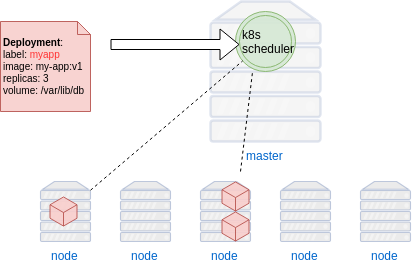

## Kubernetes


### Kubernetes Facts

* Greek word for _helmsman_ or _pilot_
* Also origin of words like _cybernetics_ and _government_
* Inspired by _Borg_, Google's internal scheduling tool
* Play on _Borg cube_
* [Source](https://news.ycombinator.com/item?id=9653797)


#### Kubernetes Host Types
* master
   - performs _scheduling_
   - monitoring/healthchecks
* node (formerly _minion_)
   - runs containers


#### Kubernetes Concepts
* Deployment
* Pod
* Services
* Labels and Selectors
* Namespaces


#### Running applications in Kubernetes
* A declarative configuration called a <!-- .element: class="fragment" data-fragment-index="0" -->_Deployment_
* Tell Kubernetes the <!-- .element: class="fragment" data-fragment-index="1" -->desired state of an application 
   + which image(s) to use for an application  <!-- .element: class="img-right" style="width:50%;" -->
   + number _replicas_ to run
   + volume mounts
* The Kubernetes <!-- .element: class="fragment" data-fragment-index="2" -->_deployment controller_ maintains that state in the cluster


#### Creating a Deployment
<code style="font-size:14pt;">kubectl run </code><code style="color:red;font-size:14pt;">name </code><code style="color:red;font-size:14pt;">--image=IMAGE:TAG</code><code style="color:green;font-size:14pt;"> OPTIONS</code>
* Example
   ```
   kubectl run nginx --image=nginx --replicas=3
   ```
* Simplest way to create a deployment in Kubernetes
   + `kubectl run` command
* CLI options  <!-- .element: class="img-right" -->
   + _name_ for the deployment
   + an image
   + other info (i.e. replicas, ports, volumes)


#### Managing Deployments
* A _Deployment_ can be modified at any time
  + _scaling_ 
     - changing number of replicas
  + _update_ 
     - change image for all instances 
* Kubernetes replication controller adapts to new desired state


#### Maintaining State of a Deployment <!-- .slide: class="image-slide" -->
 <!-- .element: class="fragment" data-fragment-index="0" -->


#### Pods
* From <!-- .element: class="fragment" data-fragment-index="1" -->_Deployment_ Kubernetes creates _Pods_
* Atomic <!-- .element: class="fragment" data-fragment-index="2" -->_run unit_ of K8s (not containers)
* An abstraction representing group <!-- .element: class="fragment" data-fragment-index="3" -->of ≥ 1 containers
   - images <!-- .element: class="img-right" style="width:50%;" -->
   - network ports
   - volumes


#### Pods
* Containers in a Pod share common <!-- .element: class="fragment" data-fragment-index="0" -->resources   
   - Network IP address  <!-- .element: class="img-right" -->
   - Mounted volumes
   - Always co-located and co-scheduled
* Containers within a Pod communicate via <!-- .element: class="fragment" data-fragment-index="1" -->_localhost_
* Deployments defined with a <!-- .element: class="fragment" data-fragment-index="2" -->_Deployment Spec_
   - typically yaml or json file <!-- .element: class="fragment" data-fragment-index="3" -->
   - number of replicas <!-- .element: class="fragment" data-fragment-index="4" -->
   - how containers are run <!-- .element: class="fragment" data-fragment-index="5" -->


#### Deployment Spec
 
<!-- .element: style="width:40%;float:right;"  -->

<pre  style="width:40%;float:left;font-size:10pt;" ><code data-trim data-noescape>
apiVersion: extensions/v1beta1
kind: Deployment
metadata:
  name: webapp
spec:
  <mark>replicas: 3</mark>
  template:
    metadata:
      labels:
        app: webapp
    spec:
      .
      .
        </code></pre>


#### Deployment Spec
 
<!-- .element: style="width:40%;float:right;"  -->

<pre  style="width:40%;float:left;font-size:10pt;" ><code data-trim data-noescape>
apiVersion: extensions/v1beta1
kind: Deployment
metadata:
  name: webapp
spec:
  replicas: 3
  template:
    metadata:
      labels:
        app: webapp
    spec:
      containers:
        <span class="fragment" data-fragment-index="0">- <mark>image: my-app:v1</mark>
          name: myapp
          volumeMounts:
          - mountPath: /var/www
            name: static-assets</span>
        <span class="fragment" data-fragment-index="1">- <mark>image: nginx:2</mark>
          name: nginx
          volumeMounts:
          - mountPath: /var/www
            name: static-assets</span>
      <span class="fragment" data-fragment-index="2">volumes:
      - name: static-assets
        emptyDir: {}</span> 
        </code></pre>


#### Container Networking
* Each Pod in k8s has its own IP (even on same node) <!-- .element: class="fragment" data-fragment-index="0" -->  <!-- .element: class="img-right" -->
* Pod IPs never exposed outside cluster <!-- .element: class="fragment" data-fragment-index="1" -->
* Need to reconcile changing Pod IPs <!-- .element: class="fragment" data-fragment-index="2" -->


#### Services
* A service defines logical set of pods and policy to access them <!-- .element: class="fragment" data-fragment-index="3" --> <!-- .element: class="img-right" -->
* Ensure Pods for a specific Deployment receive network traffic <!-- .element: class="fragment" data-fragment-index="4" -->


#### Labels & Selectors
* Labels are key/values assigned to objects in k8s
* Labels can be used in a variety of ways:  <!-- .element: class="img-right" -->
   + Classify object
   + versioning
   + designate as production, staging, etc.


#### Matching Services and Pods
* Labels provide means for _services_ to route traffic to groups of pods
* Services route traffic to Pods with certain label using Selectors  <!-- .element: class="img-right" -->


#### Service types
* _ClusterIP_
   - Exposes the Service on an internal IP in the cluster
* _NodePort_
   - Expose port on each node in cluster
* _LoadBalancer_
   - Creates LB on cloud (if supported)
* _ExternalName_ 
   - Expose service using name by returning CNAME


### Services
* Exposes IP of Pod to  <!-- .element: class="img-right" style="width:50%;" -->
    + Other Pods
    + External ports (i.e. web, API ingress)


### Defining a Service
* Service spec defines
  + Type <!-- .element: class="fragment" data-fragment-index="0" -->
     - <!-- .element: class="fragment" data-fragment-index="1" -->`NodePort | ClusterIP`
  + Ports & protocol <!-- .element: class="fragment" data-fragment-index="2" -->
  + Map to Replication Controller (Pod) <!-- .element: class="fragment" data-fragment-index="3" -->

<!-- .element: style="width:50%;float:left;"  -->

<pre style="width:40%;float:left;"><code data-trim data-noescape>
apiVersion: v1
kind: Service
metadata:
  name: redis
spec:
  <span class="fragment" data-fragment-index="1"><mark>type: ClusterIP</mark></span>
  <span class="fragment" data-fragment-index="2">ports:
  - port: 6379
    targetPort: 6379</span>
  <span class="fragment" data-fragment-index="3">selector:
    <mark>app: redis</mark></span></code></pre>


### Kubernetes Labels & Deployments <!-- .slide: class="image-slide" -->
 


### Namespaces
* Virtual cluster
* Isolate set of containers on same physical cluster


### Controlling Kubernetes
* Control plane of Kubernetes is a REST API  <!-- .element: class="img-right" style="width:60%;"  -->
* Admin cluster using `kubectl` command line client


### Demo: Set up Voting Application in Kubernetes


### Setup
* Steps needed:
   + Create host machines in the cloud
   + Set up networking
   + Install Kubernetes dependencies
      - kubectl
      - kubeadm
      - kubelet
   + Join nodes to master
   + Deploy Kubernetes spec files


#### Kubernetes Demo Repository
* Change to home directory
   ```
   $ cd
   ```
* Check out the demo repository
   ```
   $ git clone https://github.com/heytrav/k8s-ansible.git
   $ cd k8s-ansible
   ```
   <!-- .element: style="font-size:13pt;"  -->

* Follow [README](https://github.com/heytrav/k8s-ansible) instructions for
  setting up environment

<!-- .element: class="stretch"  -->


### Setting up the Voting Application
* Have a look in the `example-voting-app/k8s-specifications`


### Remotely Controlling Kubernetes
* Start kubectl proxy locally
   ```
   $ kubectl --kubeconfig ~/k8s-admin.conf proxy
   Starting to serve on 127.0.0.1:8001
   ```
* Put this terminal aside and open a new one


### Verify Kubernetes Cluster
```
$ kubectl --server=127.0.0.1:8001 get nodes

NAME               STATUS    ROLES     AGE       VERSION
trainingpc-master   Ready     master    26m       v1.10.2
trainingpc-worker1  Ready     <none>    25m       v1.10.2
trainingpc-worker2  Ready     <none>    25m       v1.10.2
```


### Create Namespace
* Create a namespace for our application

```
$ kubectl  --server=127.0.0.1:8001 create namespace vote

namespace "vote" created
```


### Watch cluster
* In another terminal, run the following
   ```
   watch -t -n1 'echo Vote Pods \
   && kubectl --server=127.0.0.1:8001 get pods -n vote -o wide \
   && echo && echo vote Services \
   && kubectl --server=127.0.0.1:8001 get svc -n vote \
   && echo && echo vote Deployments \
   && kubectl --server=127.0.0.1:8001 get deployments -n vote \
   && echo && echo Nodes \
   && kubectl --server=127.0.0.1:8001 get nodes -o wide'
   ```
   <!-- .element: style="font-size:12pt;"  -->
* We'll refer to this as the _watcher_ terminal and check on it from time to
  time

<!-- .element: class="stretch"  -->


### Load Specification Files

* The `apply` command loads a specification into kubernetes
   ```
   kubectl apply <file> 
   ```
* The entire vote app is specified in yaml files
```bash
cd ~/example-voting-app/k8s-specifications
for i in `ls *.yaml`; \
     do kubectl --server=127.0.0.1:8001 apply -n vote -f $i; done
```
<!-- .element: style="font-size:12pt;"  -->

* This tells kubernetes to begin setting up containers
  + creates network endpoints
  + assigns Pods to replication controller
* When you run this, go back to the _watcher_ terminal


### View Website
* Once all containers are running you can visit your website
* You first need to find a couple ports. Look for this in the _watcher_
  terminal:
   <pre><code data-trim data-noescape>
	vote Services
	NAME      TYPE        CLUSTER-IP       ...   PORT(S)          AGE
	db        ClusterIP   10.108.228.228   ...   5432/TCP         3h
	redis     ClusterIP   10.107.101.100   ...   6379/TCP         3h
	result    NodePort    10.107.43.36     ...   5001:<mark>31001/TCP</mark>   3h
	vote      NodePort    10.104.244.69    ...   5000:<mark>31000/TCP</mark>   3h
</code></pre> <!-- .element: style="font-size:13pt;" -->
* Navigate to the [voting app](http://voting.appl:31000). You may need to
  change the port


### Scaling 

* Orchestration platforms make it easy to scale your app up/down
   + Simply increase or decrease the number of containers
* Let's increase the number of vote containers
   ```
   kubectl --server=127.0.0.1:8001 -n vote scale deployment vote --replicas=9
   ```
   <!-- .element: style="font-size:13pt;" -->
* Play with the scaled number; keep an eye on _watcher_ terminal 


###  Updating Our Application
* Update the _vote_ application with your image
   ```
   kubectl --server=127.0.0.1:8001  \
        -n vote set image deployment/vote \
            vote=YOURNAME/vote:v2
   ```
* Watch the _watcher_ terminal
* Refresh the site several times while update is running


### Clean up

```
ansible-playbook ansible/remove-cluster-hosts.yml -K -e prefix=<username>
```
<!-- .element: style="font-size:13pt;"  -->
